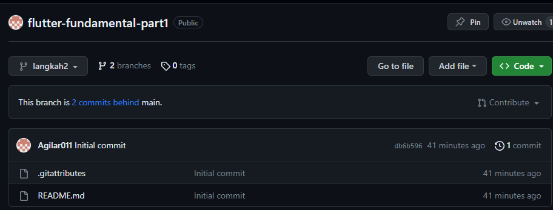
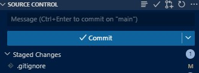
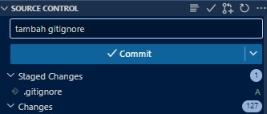
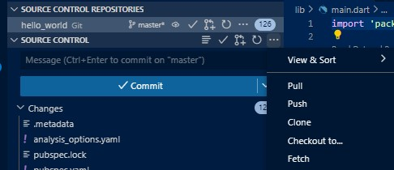
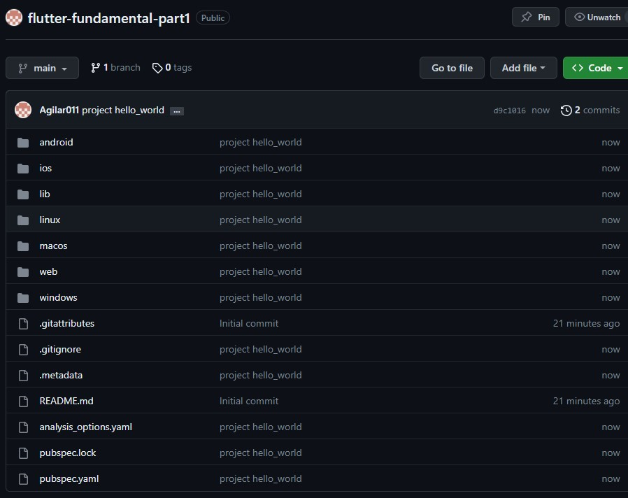
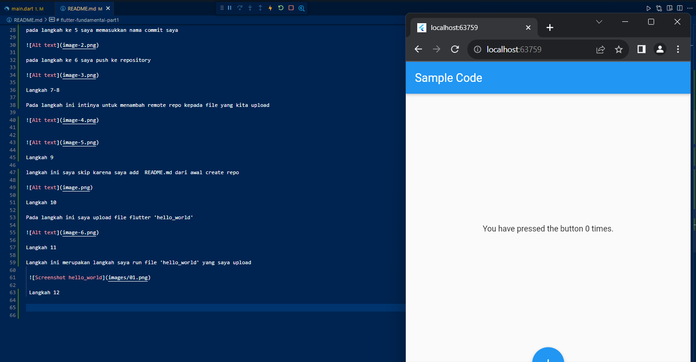

# flutter-fundamental-part1
 Pemrograman mobile polinema week 5
By : Agilae Gumilar TI3G / 03 / 2141720106

Langkah 1
Proses inisialisai repositori baru 

Untuk langkah ini saya menggunakan github destop karena memang menurut saya lebih praktis

Langkah 2

Untuk langkah 2 sendiri sebenarnya sama dengan kita menggunakan github.com

Langkah 3

Langkah 4 - 6

pada langkah 4 saya menekan tanda '+' pada perubahan itu sehingga perubahan yang saya maksud akan masuk kedalam 'staged changes' dimana itu merupakan konsep kontrol kolaborasi gituhub yang membuat file yang diupload merupakan file dalam kelompok 'staged changes'

pada langkah ke 5 saya memasukkan nama commit saya

pada langkah ke 6 saya push ke repository

Langkah 7-8

Pada langkah ini intinya untuk menambah remote repo kepada file yang kita upload

Langkah 9

langkah ini saya skip karena saya add  README.md dari awal create repo

Langkah 10

Pada langkah ini saya upload file flutter 'hello_world'

Langkah 11

Langkah ini merupakan langkah saya run file 'hello_world' yang saya upload

 Langkah 12

 langkah terakhir merupakan langkah saya memasukkan nama saya kedalam file

  

