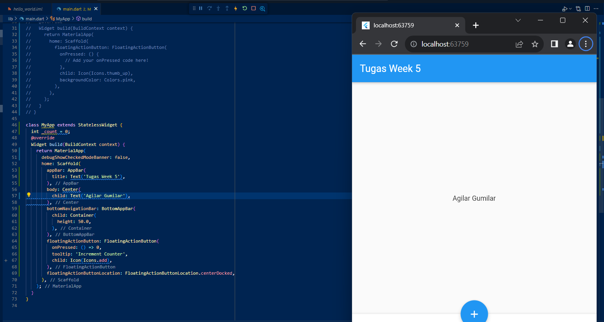

# flutter-fundamental-part1
 Pemrograman mobile polinema week 5
By : Agilae Gumilar TI3G / 03 / 2141720106

Langkah 1
Proses inisialisai repositori baru 

Untuk langkah ini saya menggunakan github destop karena memang menurut saya lebih praktis

Langkah 2

Untuk langkah 2 sendiri sebenarnya sama dengan kita menggunakan github.com

 
